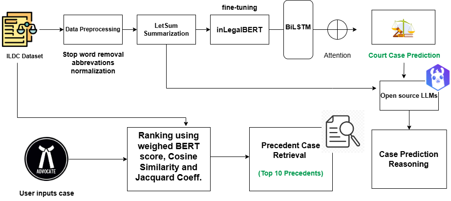

# ILCR-PR

Intelligent Legal Case Reasoning and Precedent Retrieval
(ILCR-PR) is an end-to-end NLP-driven system designed to assist in legal judgment prediction and precedent retrieval for the Indian Supreme Court. It leverages advanced language models to classify case outcomes, generate human-readable explanations, and retrieve semantically relevant past cases to support legal analysis.

---

## 🧠 Overview

The project automates three key tasks:
1. **Judgment Prediction** – Binary classification (Accepted/Rejected) using inLegalBERT + BiLSTM + Attention layers.
2. **Explanation Generation** – Justifying predictions via a fine-tuned Legal LLaMA model.
3. **Precedent Retrieval** – Ranking top-10 similar cases using a weighed combination of BERT embeddings, cosine, and Jaccard similarity.

## 🧾 Dataset

- **Name:** Indian Legal Documents Corpus (ILDC)
- **Source:** [ILDC Dataset Paper](https://aclanthology.org/2021.acl-long.313/)

## Model Architecture

The system follows a modular NLP pipeline. First, raw legal petitions are preprocessed and summarized using LetSum to focus on key arguments. These summaries are embedded using inLegalBERT, and the embeddings are passed through a BiLSTM with attention for binary classification of petition acceptance. To enhance interpretability, a fine-tuned Legal LLaMA model generates textual explanations for the predictions. Additionally, the system performs precedent retrieval by computing semantic similarity using BERT embeddings, cosine similarity, and Jaccard coefficient to rank and display the top-10 most relevant past cases.
